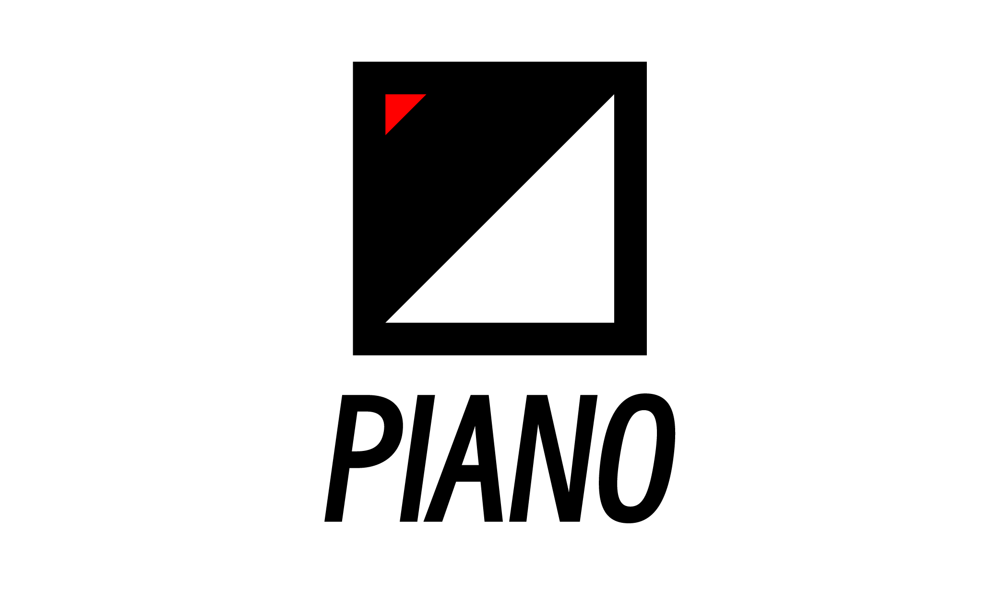

# PIANO (dev-version)

> Piano will respond to you.

PIANO is a simple and lightweight HTTP framework. More features will be supported gradually.

## Quick Start

### Hello World

[example](example/helloworld/main.go)

### Route

[example](example/route/main.go)

### Group

[example](example/group/main.go)

### Query

[example](example/query/main.go)

### Form

[example](example/form/main.go)

You can also go through the code for more information.

## END

PIANO is a subproject of the [BINARY WEB ECOLOGY](https://github.com/B1NARY-GR0UP)