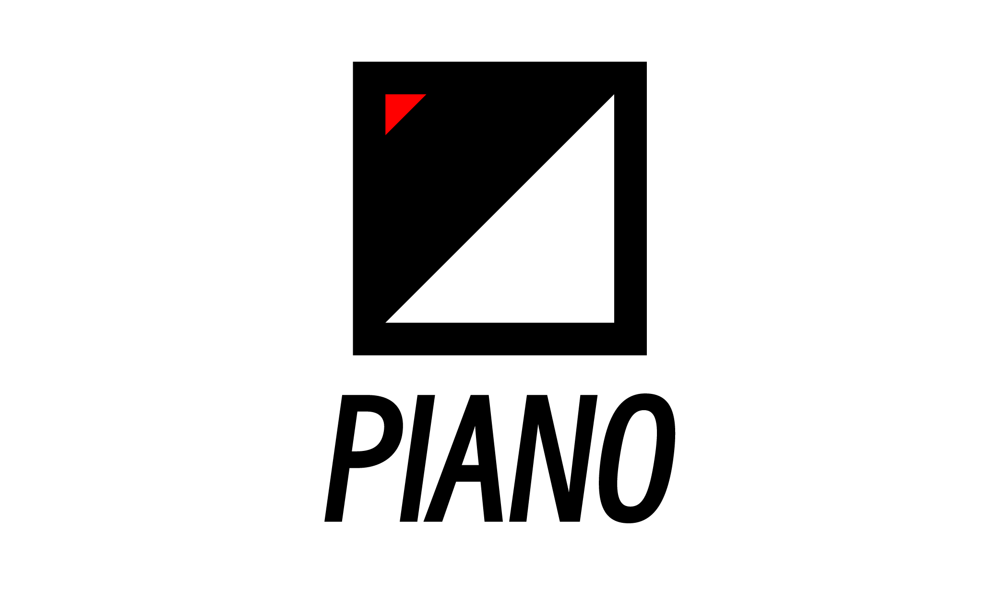

# PIANO

> Piano will respond to you.



PIANO is a simple and lightweight HTTP framework. More features will be supported gradually.

## Install

```shell
go get github.com/B1NARY-GR0UP/piano
```

## Quick Start

### Hello

[example](examples/hello)

### Route

[example](examples/route)

### Group

[example](examples/group)

### Middleware

[example](examples/middleware)

### Query

[example](examples/query)

### Form

[example](examples/form)

### Hook

[example](examples/hook)

You can also go through the code for more information.

## Related Projects

- [DREAMEMO](https://github.com/B1NARY-GR0UP/dreamemo) | A distributed cache with out-of-the-box, high-scalability, modular-design features. | `golang` `cache` `distributed`
- [INQUISITOR](https://github.com/B1NARY-GR0UP/inquisitor) | A simple and lightweight log. | `golang` `log`

## Blogs

- [PIANO: A Simple and Lightweight HTTP Framework Implemented in Go](https://dev.to/justlorain/piano-a-simple-and-lightweight-http-framework-implemented-in-go-224p)
- [如何使用 channel 实现一个优雅退出功能？](https://juejin.cn/post/7207423263344427068)

## License

PIANO is distributed under the [Apache License 2.0](./LICENSE). The licenses of third party dependencies of PIANO are explained [here](./licenses).

## END

PIANO is a subproject of the [BINARY WEB ECOLOGY](https://github.com/B1NARY-GR0UP)